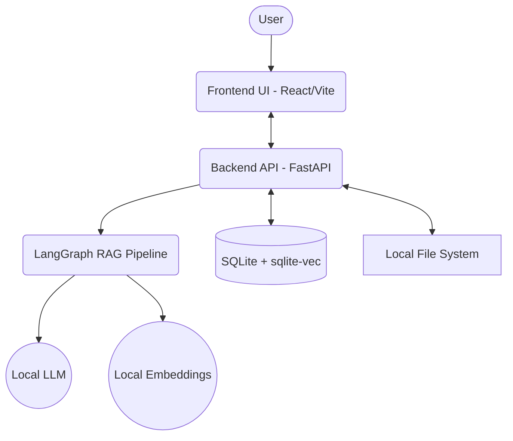

# Halo - Privacy-First AI Wealth Assistant

Halo is a local-first, privacy-focused AI wealth assistant that leverages RAG (Retrieval-Augmented Generation) to answer questions based entirely on user-provided financial documents.

## Architecture



## Setup

1. Run `scripts/setup.sh` to install dependencies and initialize the database.
2. Edit `.env` with your LLM configuration.
3. Run `scripts/start.sh` to launch both frontend and backend.

## 🔧 ONLY CHANGE THESE VALUES

In `.env`, you only need to configure the LLM. If you are using LM Studio locally:
```env
LLM_PROVIDER=LOCAL
LOCAL_LLM_BASE_URL=http://localhost:1234/v1
LOCAL_LLM_MODEL=lmstudio-community/Meta-Llama-3-8B-Instruct-GGUF
```
